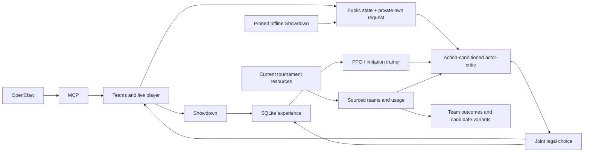

# Learning brain and OpenClaw integration

The harness still owns the Showdown account, connection, team store and
matchmaking. OpenClaw calls MCP tools. The local model selects complete legal
singles/doubles choices and learns from recorded completed games.



The model is a compact PyTorch actor-critic, with PPO's clipped objective,
GAE, a value loss and entropy regularization. It scores a variable list of joint
actions instead of assuming a fixed move index means the same thing every turn.
State and action encoders use stable feature hashing, numeric tactical features
and a sixteen-action public history. Initial logits include a type/power/STAB
prior; that prior is an approximation, not a damage simulator or an expert policy.
The learned scorer conditions on state, targets, both active Pokémon and complete
team-preview choices. Padded actions have zero probability during training.

See [model research](ml-research.md) for the primary sources, alternatives,
available human datasets and limits of published VGC claims.

## Install

Python 3.10+ and Node 22.18+ are required for this optional ML lane. The existing
basic harness can still use `requirements.txt` alone.

```bash
uv pip install --python .venv/bin/python -r requirements-ml.txt
npm install --omit=optional
npm run simulator:build
.venv/bin/python -m ml.cli dex --format gen9championsvgc2026regmc
.venv/bin/python -m pytest -q
```

`package.json` pins official Showdown commit
`c046106cbe075931b1ff8d8b800ff5be47a85f96`. This includes the current Champions M-C
rules. The older published npm simulator lacked the required current format.
Update this pin deliberately when regulations change, rebuild, refresh the
format dex and validate teams again. The live server is ultimately authoritative.

Checkpoints and SQLite experience live under `data/ml/`, and format dex tables
under `cache/dex/<format>/`. Both are gitignored. Keep them to retain learned
knowledge across OpenClaw/MCP restarts. Use a separate `--root` for experiments;
do not run multiple learning writers against the same root. Model updates are
atomic. MCP reloads externally promoted revisions between games and keeps active
games frozen. An interrupted game remains pending on disk without a reward.
After reconnecting the configured account to the same room, the recorder can
restore one compatible pending episode with its original ID, steps and collecting
log probabilities. Its format, exact team, schema, learning mode and checkpoint
must still match. An unchanged request resubmits the saved choice without
resampling. Ambiguous recording fragments or a changed checkpoint stop recovery;
they are not silently merged. A terminal reconnect finalizes the original episode
once, including when the final request is null. Proposals whose socket submission
was interrupted are excluded from terminal learning credit.

## Train locally

`examples/champions-rain.json` is a simulator-valid, self-built fixture. It is
not a claimed tournament team. Champions spreads use stat points (66 total,
32 per stat); ordinary Scarlet/Violet EV spreads are invalid here.

```bash
# Optional weak imitation warm start from the scripted tactical policy.
.venv/bin/python -m ml.cli bootstrap \
  --format gen9championsvgc2026regmc \
  --team1 examples/champions-rain.json --team2 examples/champions-rain.json \
  --games 20

# Collect stochastic decisions and apply PPO after each completed local game.
.venv/bin/python -m ml.cli local \
  --format gen9championsvgc2026regmc \
  --team1 examples/champions-rain.json --team2 examples/champions-rain.json \
  --games 100 --opponent heuristic

# Frozen model opponent for this run; no extra public accounts are involved.
.venv/bin/python -m ml.cli local \
  --format gen9championsvgc2026regmc \
  --team1 examples/champions-rain.json --team2 examples/champions-rain.json \
  --games 100 --opponent self

# Deterministic held-out decisions; no recorded PPO rollouts or weight updates.
.venv/bin/python -m ml.cli evaluate \
  --format gen9championsvgc2026regmc \
  --team1 examples/champions-rain.json --team2 examples/champions-rain.json \
  --games 50 --seed 1000 --opponent heuristic --alternate-sides
```

Opponents: `heuristic`, `random`, or `self`. The self opponent is a frozen
checkpoint from the start of that run, not a population league. Supply different
validated team files to broaden training. Generated random formats also work
without `--team1/--team2`, e.g. `gen9randomdoublesbattle`.

Local games use official `BattleStream` mechanics and its separate player
streams. Python never receives the omniscient replay as an observation. Open team
sheets are revealed locally by both sides' consent; closed-sheet live opponents
stay hidden unless they actually accept/reveal them. No public network login or
account creation is involved in local training.

Rewards are terminal win `+1`, loss `-1`, tie `0`. Unfinished, rejected and timed-out
decisions do not become wins or losses. PPO consumes only completed sampled
trajectories from the exact collecting revision, once. Demonstrations use a
separate behavior-cloning trainer. Keep the learning mode and team stable during
a recorded game. Finish active games before changing model weights.

Reports include seeds, outcomes, rejected-action counts and update revisions.
Increasing training steps or reducing loss does not prove better VGC play.
Compare frozen checkpoints on the same held-out opponents/teams and seeds,
swap sides, and report uncertainty before deciding to deploy an update. Direct
experimental CLI training saves its next checkpoint immediately. Automatic MCP
and scheduled learning now use the resource-aware candidate promotion gate in
[continuous learning](continuous-learning.md). Preserve a root copy for experiments.

## OpenClaw MCP flow

Start/restart the same stdio MCP server after installing the optional dependencies.
Use the account already configured in `.env`; call `ps_login` once per process.

1. `ps_team_create` or `ps_research_paste(..., save_as="Team name")` creates a team.
2. `ps_team_validate("Team name")` checks its exact format and sets.
3. `ps_login()` and `ps_ladder(format, team="Team name")` enter matchmaking.
4. Read `ps_waiting()`, then either let `ps_ml_play(room, format, team, learn=True)`
   handle the full battle, or call `ps_ml_choose(room, format, team, explore=True)`
   once for each new request. `ps_ml_choose` is idempotent and retries rejected
   proposals against updated requests. It retains the same connection.
5. With individual choices, call `ps_ml_finish(room, train=True)` after the terminal
   result. The full-game tool and observer also finalize it automatically. Learning
   runs in a durable background job and evaluates a candidate before promotion.
6. `ps_ml_status(format)` shows revisions, update counts and experience/research
   totals. `ps_team_recommend(format)` ranks exact team versions using ladder
   results; `evidence_source="local"` examines local-game evidence separately.

`ps_ml_decide` only recommends a choice and shows policy probabilities; it does
not submit or record it. A probability is a policy preference, not calibrated
confidence or a guaranteed win probability. Use `explore=False`/`learn=False`
for deterministic play without collecting PPO training data.

For expert steering, submit a whole game's choices with
`ps_ml_demonstrate(room, format, choice, team)`, finalize it with
`ps_ml_finish(room, train=False)`, then use
`ps_ml_train(format, imitation=True)`. These labels can come from a human or a
reviewed agent decision. Do not mix sampled PPO and demonstrated decisions in
one recorded game. Research documents alone are never action labels.

The CLI live equivalent is:

```bash
.venv/bin/python -m ml.cli play \
  --format gen9championsvgc2026regmc --team 'Team name' --games 5
```

It logs in once, validates/uploads the team, searches, plays and learns, reusing
the same client. A stalled game stops the batch instead of starting another
battle. MCP `ps_ml_play` similarly returns an unfinished result without assigning
a reward; use the existing room again to continue while the process remains alive.

## Human demonstration import

`import-demo` accepts JSONL rows containing exact format, `choice` and `context`.
The context needs a real `request` and either a perspective-correct `state` or
public `log` available **at that decision**. Example for a singles request:

```json
{"format":"gen9ou","source":"reviewed-human-example","choice":"move 2","context":{"request":{"rqid":1,"side":{"id":"p1","pokemon":[{"details":"Pelipper, L100","condition":"100/100","active":true}]},"active":[{"moves":[{"move":"Hurricane","target":"normal","pp":10},{"move":"Protect","target":"self","pp":10}]}]},"log":[]}}
```

```bash
.venv/bin/python -m ml.cli import-demo examples.jsonl --format gen9ou
.venv/bin/python -m ml.cli train --format gen9ou --imitation --epochs 10
```

No human corpus or pretrained expert checkpoint ships with this implementation.
VGC-Bench has a relevant Champions M-A/M-B corpus, but its raw replay
reconstruction/checkpoint interface has not been ported. Raw public replays are
not accepted as exact request data. The JSONL importer requires normalized
observations, with all future and private opposing information excluded.

## Current web research and team building

`ps_research_search` searches live Limitless/Victory Road tournament/team indexes
without credentials. With `BRAVE_SEARCH_API_KEY` in the process environment it
uses Brave's broader search API. `ps_research_fetch` caches supported source
pages with their URL, fetch time and published date where available;
`ps_research_read` retrieves same-format evidence for OpenClaw to inspect.
The format tag is caller-supplied, not automatically verified from prose.

```bash
.venv/bin/python -m ml.cli research 'Champions M-C winning teams' \
  --format gen9championsvgc2026regmc --fetch 3
.venv/bin/python -m ml.cli usage --format gen9championsvgc2026regmc --month 2026-09
.venv/bin/python -m ml.cli import-team https://pokepast.es/PASTE_ID \
  --format gen9championsvgc2026regmc --player 'Credited player' \
  --event 'Source event' --save-as 'Imported team'
```

The equivalent tools are `ps_research_usage`, `ps_research_paste` and
`ps_research_team`. All MCP team imports go through simulator validation.
Discovery returns candidates, including archives that may contain older sets;
verify regulation, event and player before importing. Never invent missing
spreads and attribute them to a player. Invalid pastes are rejected.

Validated imported teams and published exact-format usage provide bounded
species-frequency features to the model. Web prose remains evidence for the
orchestrating agent. The research store keeps citations and separates formats.
Fetches have byte/time limits and an explicit source-domain list.

Team recommendations use a Beta win-rate posterior with uncertainty, indexed by
format, exact set fingerprint and local/ladder evidence. Unplayed teams have no
demonstrated advantage. `exploration_score` favors testing uncertain candidates.
`ps_team_variants` proposes same-species complete set replacements from attributed
same-format research; save candidates under new names, validate and evaluate them
before ladder use. This is experience-based selection and constrained team
improvement, not a solved model for inventing globally optimal teams.
