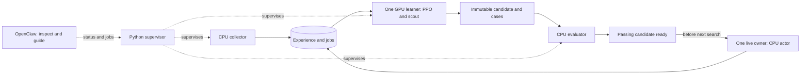

# Continuous play, collection and training

The battle model keeps playing while experience is collected and trained in the
background. A retained Python supervisor owns the work queue; OpenClaw inspects
progress and guides experiments. The live campaign independently owns its one
player connection.

## The model and its data

`ml/model.py` implements a **97,826-parameter action-conditioned actor-critic**.
`Features` builds a 384-dimensional observed state and a 192-dimensional vector
for each complete legal action. Doubles actions include both Pokemon's choices,
targets and eligible modifiers; team preview is another legal action set. Hidden
information remains hidden. State/action encoders have 128/96 outputs. The joined
representation feeds an action score; a critic predicts the outcome from state.
The score includes the mechanical heuristic in the last action feature, so
learning adjusts that prior. Illegal/padded actions receive no probability.

`Brain` encodes the request/observations, adds bounded research/scout inputs,
samples the actor, and records encoded inputs, selected action, log probability
and value. The harness submits the choice, handles disclosed unavailable actions
and removes rejected proposals. A verified terminal win/loss/draw gives +1/-1/0;
an interruption gets no fabricated reward. Recorder 3 also preserves readable
pre-decision snapshots, log-prefix hashes, own sets, collecting checkpoint/dex
digests and simulation conditions. New steps include CPU preparation/prediction
duration before recording I/O.

PPO uses complete, unused, compatible sampled trajectories from the same actor
revision, validating masks, structure and collecting likelihoods first. GAE uses
gamma 0.99/lambda 0.95; Adam uses 3e-4, ratio clipping 0.8..1.2, critic weight 0.5,
entropy weight 0.01 and gradient norm 0.5. Defaults are four epochs, 32-step
minibatches and a whole-batch approximate-KL stop at 0.03. A bounded tensor cache
avoids repeatedly rebuilding feature lists.

| Learned role | Evidence | Meaning |
| --- | --- | --- |
| Battle actor/critic | Compatible own-policy completed trajectories | Actions associated with winning outcomes |
| Public-move scout | Executed moves, strictly pre-turn observations | Likely opposing moves |
| Team bandit | Outcomes for exact team versions | Teams this actor pilots successfully |
| Explicit imitation | Demonstrated legal choices | A teacher's selected action |

Public replays lack private requests and collecting probabilities: they supply
scouting evidence, not fabricated PPO rollouts. Older-policy matches remain
archived for scouting, diagnosis and separately evaluated future algorithms.
Our own winning moves do not become expert demonstrations. Evaluation games
do not become PPO training games. Consuming a batch means it produced a saved
candidate, not that an improved actor was promoted.

## Four independent responsibilities



The supervisor polls every 15 seconds. Collector, learner and evaluator claim
practice, learning/feed and evaluation jobs respectively, using separate OS
locks and atomic SQLite claims. The learner retains `worker.lock`, preventing a
legacy worker from starting another trainer. Per-battle jobs remain durably queued
when immediate kicks are suppressed; the supervisor drains that same queue.

The collector validates the team pool/focused team, snapshots the CPU actor and
freezes research and distinct scout move support from one SQLite read snapshot.
The immutable inputs include exact scout weights and are shared by content; full
training vectors and replay bodies remain in the canonical store. Both learner and
frozen self-play opponent read those inputs while all recordings/public experience
go to the shared store. Games use the pinned official simulator, mixed opponents,
alternating sides, full seeds and configured sheet visibility. Partial bounded
collections retain their data and hand off learning; the next job has fresh seeds.
A crash can reclaim its lease; existing complete/pending records remain archived.

The learner saves a candidate and complete evaluation plan, marks only its
consumed episodes and durably queues evaluation. Reclaimed jobs with saved state
repeat this idempotent handoff instead of retraining. While the CPU evaluator
tests one candidate, the GPU learner can train another unused current-policy
batch. Defaults allow two in-flight candidates per parent and a 1,024-step unused
backlog before slowing local production. Checks occur between batches, so one
batch can overshoot the backlog. Live recording continues independently.

Candidates start from the playing parent on disjoint unused batches. An
unevaluated candidate never becomes the next training parent. Evaluation uses
identical frozen inputs, seeds, sides, teams and opponent identity for both actors.
Completed cases persist across retries. A passing gate requires clean complete
games, the configured win margin and one-sided paired sign-test p <=0.05.

The evaluator stages a passing candidate. Only the live matchmaking boundary
verifies checksum/parent and promotes with no pending ladder recording. Candidates
from an advanced parent become stale audit evidence. Repeated finite gates do not
establish tournament strength or a campaign-wide false-positive guarantee.

## Shared M5 resources

CPU/GPU share physical memory on Apple silicon. GPU training still competes with
daily applications for memory. [Apple's Metal compute explanation](https://developer.apple.com/videos/play/tech-talks/10580/).

The deployed budgets retain three reserved CPU cores, 2 GiB available RAM, a 75%
measured host CPU ceiling, four total simulator slots, two training threads,
12% of the recommended MPS allocator budget, 50% GPU duty and 150 GB retained model data.
These are cooperative processing limits, not OS quotas or guaranteed desktop
latency. Collector/evaluator pools split capacity; shared advisory slots also
bound their simultaneous waves. Headroom is rechecked between waves. Pools exit
after bounded cycles. Launchd uses background priority and low-priority I/O.

Training checks CPU, RAM, macOS memory pressure, free disk and swap-out rate at
minibatch/validation checkpoints, sampling at most every five seconds. Red
critical pressure (level 4) or swap-out above 32 MiB/s yields the private update; source
experience stays unused and the playing checkpoint stays intact. Old swap
occupancy alone does not prove current pressure. Yellow warning pressure (level 2)
permits work when the separate CPU, free-memory and swap-rate limits pass. Darwin uses the kernel's
exported dispatch-level conversion. [Apple XNU implementation](https://github.com/apple-oss-distributions/xnu/blob/main/bsd/kern/kern_memorystatus_notify.c).

MPS fraction caps an allocator relative to recommended working-set size; it is
not GPU utilization or reserved cores. [PyTorch allocation limit](https://docs.pytorch.org/docs/stable/generated/torch.mps.set_per_process_memory_fraction.html).
Duty pauses follow synchronized completed optimizer work. Reports include device,
optimizer steps, training duration, MPS allocator/driver bytes, jobs and backlog.
Auto selection retains the measured CPU/MPS benchmark and failure fallback;
explicit `backend: "mps"` is available on compatible hosts.

GPU idle time is appropriate without an eligible batch or candidate capacity.
Repeatedly fitting stale PPO data to fill the GPU changes the learning assumptions.
This small network can be dispatch/preparation-bound. Further duty, minibatch or
worker increases should compare updates/games per hour against inference latency
and pressure using [the controlled M5 protocol](m5-learning-orchestration-research.md).
This removes scheduling gaps; it does not claim peak utilization or improved play.

## Operate and inspect

```bash
.venv/bin/python -m ml.pipeline
.venv/bin/python scripts/learning_service.py install --pipeline
.venv/bin/python -m ml.pipeline --status
.venv/bin/python -m ml.cli continuous --disable
```

Configuration lives in gitignored `data/ml/autopilot.json`. Status files are
`pipeline-status.json` and `pipeline-{collector,learner,evaluator}.json`; logs are
under `data/ml/logs/`. `ps_learning_status` exposes the same pipeline status.
Storage admission reserves 10% for live finalization and stops optional production
and new browser searches at 135 GB. Model data accounting includes experiments and
caches; identical inference inputs and historical archive chunks are shared.
[Storage and quality policy](model-storage.md) explains exact-byte restoration,
retained evidence and the cooperative limit. Disabled learning stops new jobs; running bounded
jobs finish/yield cooperatively. Removing the service affects only this project.

The campaign's `control.json` supports `continuous: true`: its numeric target is
a milestone. `pause_ladder: true` stops new searches after resolving the active
battle. `continuous: false` restores its target/deadline policy. These controls
never force a surrender or change account. A repository owner lock prevents two
retained controllers; an unrelated manually launched client is outside that lock.
Blocked recovery retains the exact room evidence instead of inventing outcomes.

## OpenClaw's role

OpenClaw periodically inspects status, verifies campaign/learner progress and
recommends experiments. The scheduled read-only prompt is
[openclaw-pipeline-monitor.md](openclaw-pipeline-monitor.md); conclusions stay in
automation history. Interactive requests can queue work with `ps_learning_run`.
Reasoning is unnecessary on every battle turn or optimizer step.

Isolated cron turns can inspect retained owners, but must not recreate the player:
one-shot runs retire their MCP runtimes even with retained transcripts.
[OpenClaw runtime lifecycle](https://docs.openclaw.ai/cli/mcp/registry).
An installed service carries the continuing intent after a conversational answer;
the conversational assistant itself does not stay active indefinitely. Claims
of stronger play still need held-out evaluations and separate ladder evidence.

## Updating a running service

Compatible tested code can be deployed while a battle is active. The live
controller finishes and records that battle, notices the source fingerprint
change, closes its MCP process, and exits with code 75. Its existing launchd
owner starts a fresh controller/MCP before searching for the next battle. This
is process replacement at a battle boundary; optional Python battle modules are
loaded before serving games so new lazy imports do not introduce edited code
into the current game. New recordings include the pinned source generation.

The pipeline supervisor detects source changes, stops launching work, lets its
owned children finish, and requests a supervised restart. Workers stop taking
jobs under their old generation. Simulator waves finish before source checks;
spawned games refuse a mismatched generation. Unsaved training updates yield on
source change without consuming their data. Background code updates consequently
take effect at safe work boundaries, which can be later than the next live battle.

Evaluations are tied to a source generation. Results from different generations
cannot be combined, and a candidate evaluated under old source cannot be promoted
after a deployment. Legacy plans without a fingerprint retain their old results
but start a fresh comparison in a generation-specific directory. Candidate weights
still require the existing evaluation gate before a between-game promotion.

For another agent, the deployment workflow is:

1. Develop in a separate checkout/worktree so partial edits do not reach the live
   source watcher. Run the offline suite and applicable simulator/browser checks.
2. Apply the complete validated change to the actual service checkout. A GitHub
   push alone does not deploy to a separate local checkout. The services detect
   the changed source and reload at their respective safe boundaries.
3. Inspect `source_generation` in campaign, supervisor and worker status, and new
   recordings, to verify adoption. Keep old checkpoints and evaluation reports.

Configuration is read at the next search or bounded background cycle. Database
records remain in the shared WAL store; new data does not require code replacement.
Model architecture, feature meanings, storage schema or dependency changes need
an explicit compatible version/migration and validation. Merely editing them
cannot guarantee that old weights or histories will load, or that playing
strength improves. This reload mechanism does not provide automatic code rollback.
